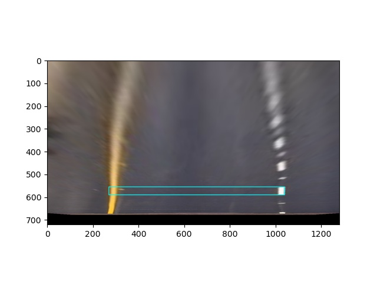
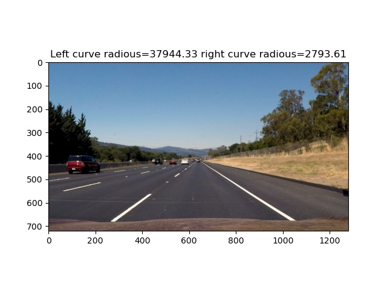
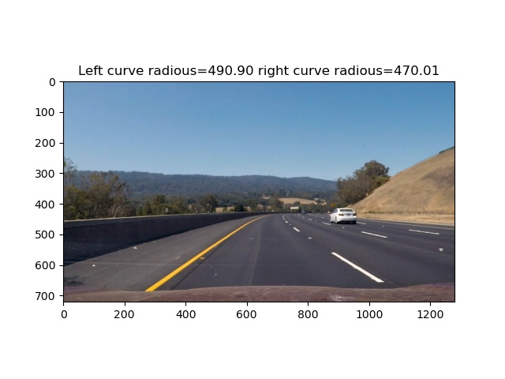
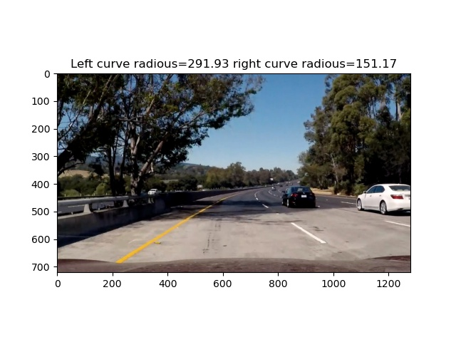

# Advanced Lane Finding Project


The goals / steps of this project are the following:

* Compute the camera calibration matrix and distortion coefficients given a set of chessboard images.
* Apply a distortion correction to raw images.
* Use color transforms, gradients, etc., to create a thresholded binary image.
* Apply a perspective transform to rectify binary image ("birds-eye view").
* Detect lane pixels and fit to find the lane boundary.
* Determine the curvature of the lane and vehicle position with respect to center.
* Warp the detected lane boundaries back onto the original image.
* Output visual display of the lane boundaries and numerical estimation of lane curvature and vehicle position.

[//]: # (Image References)

[image1]: ./examples/undistort_output.png "Undistorted"
[image2]: ./test_images/test1.jpg "Road Transformed"
[image3]: ./examples/binary_combo_example.jpg "Binary Example"
[image4]: ./examples/warped_straight_lines.jpg "Warp Example"
[image5]: ./examples/color_fit_lines.jpg "Fit Visual"
[image6]: ./examples/example_output.jpg "Output"
[video1]: ./project_video.mp4 "Video"

## [Rubric](https://review.udacity.com/#!/rubrics/571/view) Points

### Camera calibration

The camera calibration was done using chessboard images found in [camera_cal](./camera_cal). First the intersection points were found and using cv2.calibrateCamera function the distortion matrix and the distortion coefficients were computed for each of the images. Later the matrix and the coefficient were averaged to produce a single method. The matrix was saved as mtx_dist.npy and the parameters as parameters_dist.npy. Then this parameters are used to undistort images by loading the numpy arrays. This methods was validated by undistorting the calibration images. These are some examples:

Before:


After


To see all the images go to [output_images/calibration/](./output_images/calibration/). To find more details of the process consult [pipeline/camera_calibration.ipynb](./pipeline/camera_calibration.ipynb).

### Threshold binary generation

The threshold binary image generation consists on a transformation to the hls color space.Then it has two contributions:

1. A Sobel x derivative to the l chanel and then a threshold to the result.
2. A threshold to the s chanel is applied

Then both contribution are combined. We can see the individual contribution in this image for example where the first contribution is green and the second in blue.


We can see that together most of the lines are detected. To see all the images go to [output_images/threshold/](./output_images/threshold/). To find more details of the process consult [pipeline/threshold.ipynb](./pipeline/threshold.ipynb).

### Eagle eye view

For this transformation the straight lines images provided in the calibration images were used. The idea was to find 4 points which would land on the lane for both images. This points were set as the source and the destination was a rectangle using the widest x separation as base. The mtx_perspective and mtx_inv_perspective were obtained using cv2.getPerspectiveTransform, and then used  with the function cv2.warpPerspective to apply the transformation. The images were tested to see if the transformation produced straight lines. We can see that is is fulfilled:

Original:


Eagle eye:


To find more details of the process consult [pipeline/eagle_eye.ipynb](./pipeline/eagle_eye.ipynb).

### Detect lane pixels and fit to find the lane boundary.

To perform this 2 method were implemented:

1. find_lane_pixels_window this method uses the moving windows shown in class to find the relevant points from each lane. The windows are originally positioned by a histogram method.
2. fit_around_poly the window is the previous polifit from the last image, which is delimitated with a margin.

The first method is use in the first frame of the video. Later it is used the second and it was observed that the result with the second were more stable and more efficient to compute. We can see the fitting in eagle view for both methods below:

Moving window:


Fit around polynomial


To see all the images go to [output_images/lane_detection/](./output_images/lane_detection/). To find more details of the process consult [pipeline/lane_detection.ipynb](./pipeline/lane_detection.ipynb).

### Determine the curvature of the lane and vehicle position with respect to center.

To obtain an approximation of the pixel to meter ratio, I used the straight image 1, then apply an eagle eye view and visually fit a square from lane line to lane line, and between a dash-line. Knowing that the standard lane line has width of 3.7m and the standard dash line 3m. I computed an approximated ym_per_pix and xm_per_pix ratio.



With this ratios a defined a transformation to real world meters for the new coefficient of the polynomial fit. Having the coefficients in meters then it is only needed to apply the formula. The values seem to be reasonable. The 1 KM was not obtain but the values are in magnitude range of the problem and it behaves as expected in most of the cases. In strait lines being a big value for example:



And for sharp curves having a smaller value:





There are some cases in which the 2 lanes show different curvature, specially if there was a lane with hard conditions as the following one in which there is a shadow and a change of color in the road. Consequently there is still room for improvement or at least selection of the most accurate value in between this 2.

To approximate the car position with respect to the lane I will assume the camera is at the center of the car and aligned with the lane. So I will compute the lane closest to the car and make an interpolation using the lane width od 3.7m

To find more details of the process consult [pipeline/lane_curvature_and_position.ipynb](./pipeline/lane_curvature_and_position.ipynb).

### Warp the detected lane boundaries back onto the original image

This was done using the previously computed mtx_inv_perspective in the eagle eye, and using the cv2.warpPerspective. Since the computation were done using the lower part of the image. The image was translated by y_half

### Output visual display of the lane boundaries and numerical estimation of lane curvature and vehicle position.

### Writeup / README

#### 1. Provide a Writeup / README that includes all the rubric points and how you addressed each one.  You can submit your writeup as markdown or pdf.  [Here](https://github.com/udacity/CarND-Advanced-Lane-Lines/blob/master/writeup_template.md) is a template writeup for this project you can use as a guide and a starting point.  

You're reading it!

### Camera Calibration

#### 1. Briefly state how you computed the camera matrix and distortion coefficients. Provide an example of a distortion corrected calibration image.

The code for this step is contained in the first code cell of the IPython notebook located in "./examples/example.ipynb" (or in lines # through # of the file called `some_file.py`).  

I start by preparing "object points", which will be the (x, y, z) coordinates of the chessboard corners in the world. Here I am assuming the chessboard is fixed on the (x, y) plane at z=0, such that the object points are the same for each calibration image.  Thus, `objp` is just a replicated array of coordinates, and `objpoints` will be appended with a copy of it every time I successfully detect all chessboard corners in a test image.  `imgpoints` will be appended with the (x, y) pixel position of each of the corners in the image plane with each successful chessboard detection.  

I then used the output `objpoints` and `imgpoints` to compute the camera calibration and distortion coefficients using the `cv2.calibrateCamera()` function.  I applied this distortion correction to the test image using the `cv2.undistort()` function and obtained this result: 

![alt text][image1]

### Pipeline (single images)

#### 1. Provide an example of a distortion-corrected image.

To demonstrate this step, I will describe how I apply the distortion correction to one of the test images like this one:
![alt text][image2]

#### 2. Describe how (and identify where in your code) you used color transforms, gradients or other methods to create a thresholded binary image.  Provide an example of a binary image result.

I used a combination of color and gradient thresholds to generate a binary image (thresholding steps at lines # through # in `another_file.py`).  Here's an example of my output for this step.  (note: this is not actually from one of the test images)

![alt text][image3]

#### 3. Describe how (and identify where in your code) you performed a perspective transform and provide an example of a transformed image.

The code for my perspective transform includes a function called `warper()`, which appears in lines 1 through 8 in the file `example.py` (output_images/examples/example.py) (or, for example, in the 3rd code cell of the IPython notebook).  The `warper()` function takes as inputs an image (`img`), as well as source (`src`) and destination (`dst`) points.  I chose the hardcode the source and destination points in the following manner:

```python
src = np.float32(
    [[(img_size[0] / 2) - 55, img_size[1] / 2 + 100],
    [((img_size[0] / 6) - 10), img_size[1]],
    [(img_size[0] * 5 / 6) + 60, img_size[1]],
    [(img_size[0] / 2 + 55), img_size[1] / 2 + 100]])
dst = np.float32(
    [[(img_size[0] / 4), 0],
    [(img_size[0] / 4), img_size[1]],
    [(img_size[0] * 3 / 4), img_size[1]],
    [(img_size[0] * 3 / 4), 0]])
```

This resulted in the following source and destination points:

| Source        | Destination   | 
|:-------------:|:-------------:| 
| 585, 460      | 320, 0        | 
| 203, 720      | 320, 720      |
| 1127, 720     | 960, 720      |
| 695, 460      | 960, 0        |

I verified that my perspective transform was working as expected by drawing the `src` and `dst` points onto a test image and its warped counterpart to verify that the lines appear parallel in the warped image.

![alt text][image4]

#### 4. Describe how (and identify where in your code) you identified lane-line pixels and fit their positions with a polynomial?

Then I did some other stuff and fit my lane lines with a 2nd order polynomial kinda like this:

![alt text][image5]

#### 5. Describe how (and identify where in your code) you calculated the radius of curvature of the lane and the position of the vehicle with respect to center.

I did this in lines # through # in my code in `my_other_file.py`

#### 6. Provide an example image of your result plotted back down onto the road such that the lane area is identified clearly.

I implemented this step in lines # through # in my code in `yet_another_file.py` in the function `map_lane()`.  Here is an example of my result on a test image:

![alt text][image6]

---

### Pipeline (video)

#### 1. Provide a link to your final video output.  Your pipeline should perform reasonably well on the entire project video (wobbly lines are ok but no catastrophic failures that would cause the car to drive off the road!).

Here's a [link to my video result](./project_video.mp4)

---

### Discussion

#### 1. Briefly discuss any problems / issues you faced in your implementation of this project.  Where will your pipeline likely fail?  What could you do to make it more robust?

Here I'll talk about the approach I took, what techniques I used, what worked and why, where the pipeline might fail and how I might improve it if I were going to pursue this project further.  
