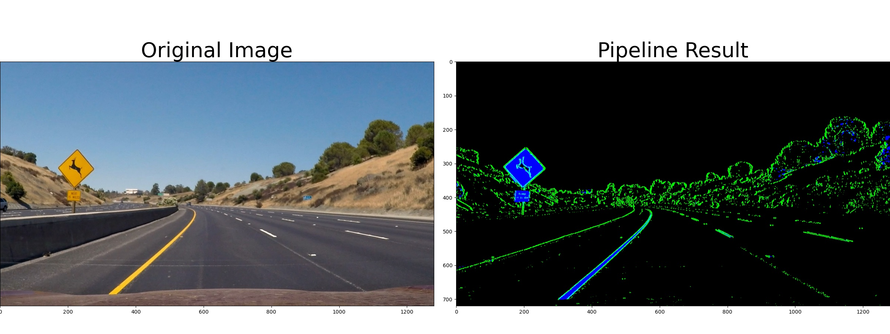
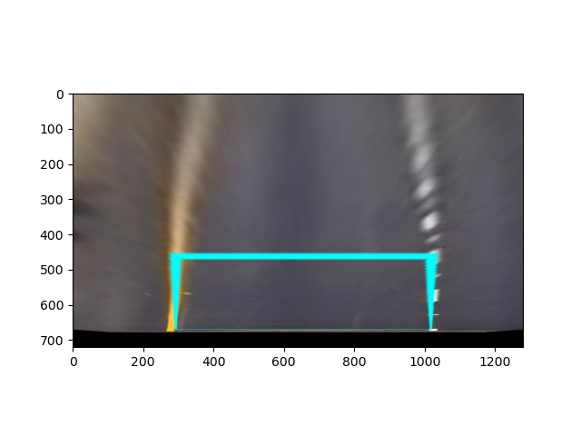

## Writeup Template

### You can use this file as a template for your writeup if you want to submit it as a markdown file, but feel free to use some other method and submit a pdf if you prefer.

---

**Advanced Lane Finding Project**

The goals / steps of this project are the following:

* Compute the camera calibration matrix and distortion coefficients given a set of chessboard images.
* Apply a distortion correction to raw images.
* Use color transforms, gradients, etc., to create a thresholded binary image.
* Apply a perspective transform to rectify binary image ("birds-eye view").
* Detect lane pixels and fit to find the lane boundary.
* Determine the curvature of the lane and vehicle position with respect to center.
* Warp the detected lane boundaries back onto the original image.
* Output visual display of the lane boundaries and numerical estimation of lane curvature and vehicle position.

[//]: # (Image References)

[image1]: ./examples/undistort_output.png "Undistorted"
[image2]: ./test_images/test1.jpg "Road Transformed"
[image3]: ./examples/binary_combo_example.jpg "Binary Example"
[image4]: ./examples/warped_straight_lines.jpg "Warp Example"
[image5]: ./examples/color_fit_lines.jpg "Fit Visual"
[image6]: ./examples/example_output.jpg "Output"
[video1]: ./project_video.mp4 "Video"

### Camera Calibration

#### 1. Briefly state how you computed the camera matrix and distortion coefficients. Provide an example of a distortion corrected calibration image.

The camera calibration was done using chessboard images found in [camera_cal](./camera_cal). First the intersection points were found and using cv2.calibrateCamera function the distortion matrix and the distortion coefficients were computed for each of the images. Later the matrix and the coefficient were averaged to produce a single method. The matrix was saved as mtx_dist.npy and the parameters as parameters_dist.npy. Then this parameters are used to undistort images by loading the numpy arrays. This methods was validated by undistorting the calibration images. These are some examples:

Before:

After

To see all the images go to [output_images/calibration/](./output_images/calibration/). To find more details of the process consult [pipeline/camera_calibration.ipynb](./pipeline/camera_calibration.ipynb).

### Pipeline (single images)

#### 1. Provide an example of a distortion-corrected image.

To demonstrate this step, I will describe how I apply the distortion correction to one of the test images like this one:

Before:

After

#### 2. Describe how (and identify where in your code) you used color transforms, gradients or other methods to create a thresholded binary image.  Provide an example of a binary image result.

The threshold binary image generation consists on a transformation to the hls color space.Then it has two contributions:

1. A Sobel x derivative to the l chanel and then a threshold to the result. Found in [pipeline/pipeline.py](./pipeline/pipeline.py) line 33 to 42
2. A threshold to the s chanel is applied. Found in [pipeline/pipeline.py](./pipeline/pipeline.py) line 43 to 45

Then both contribution are combined. We can see the individual contribution in this image for example where the first contribution is green and the second in blue.

We can see that together most of the lines are detected. To see all the images go to [output_images/threshold/](./output_images/threshold/). To find more details of the process consult [pipeline/threshold.ipynb](./pipeline/threshold.ipynb).

![alt text][image3]

#### 3. Describe how (and identify where in your code) you performed a perspective transform and provide an example of a transformed image.

For this transformation the straight lines images provided in the calibration images were used. The idea was to find 4 points which would land on the lane for both images. This points were set as the source and the destination was a rectangle using the widest x separation as base. The mtx_perspective and mtx_inv_perspective were obtained using cv2.getPerspectiveTransform, and then used  with the function cv2.warpPerspective to apply the transformation. The images were tested to see if the transformation produced straight lines. We can see that is is fulfilled:

Original:

Eagle eye:

To find more details of the process consult [pipeline/eagle_eye.ipynb](./pipeline/eagle_eye.ipynb). The actual function used in the pipeline is found in [pipeline/pipeline.py](./pipeline/pipeline.py) line 53 to 61

![alt text][image4]

#### 4. Describe how (and identify where in your code) you identified lane-line pixels and fit their positions with a polynomial?

Then I did some other stuff and fit my lane lines with a 2nd order polynomial kinda like this:

![alt text][image5]

#### 5. Describe how (and identify where in your code) you calculated the radius of curvature of the lane and the position of the vehicle with respect to center.

To perform this 2 method were implemented:

1. find_lane_pixels_window this method uses the moving windows shown in class to find the relevant points from each lane. The windows are originally positioned by a histogram method. This code is found in found in [pipeline/pipeline.py](./pipeline/pipeline.py) line 73 to 139
2. fit_around_poly the window is the previous polifit from the last image, which is delimitated with a margin. This code is found in found in [pipeline/pipeline.py](./pipeline/pipeline.py) line 155 to 180

The first method is use in the first frame of the video. Later it is used the second and it was observed that the result with the second were more stable and more efficient to compute. We can see the fitting in eagle view for both methods below:

Moving window:

Fit around polynomial

To see all the images go to [output_images/lane_detection/](./output_images/lane_detection/). To find more details of the process consult [pipeline/lane_detection.ipynb](./pipeline/lane_detection.ipynb).

### Pipeline (video)

#### 1. Provide a link to your final video output.  Your pipeline should perform reasonably well on the entire project video (wobbly lines are ok but no catastrophic failures that would cause the car to drive off the road!).

Here's a [link to my video result](./output_images/pipeline/project_video.mp4)

### Discussion

#### 1. Briefly discuss any problems / issues you faced in your implementation of this project.  Where will your pipeline likely fail?  What could you do to make it more robust?

Here I'll talk about the approach I took, what techniques I used, what worked and why, where the pipeline might fail and how I might improve it if I were going to pursue this project further.  